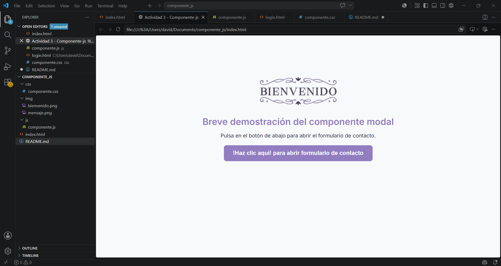
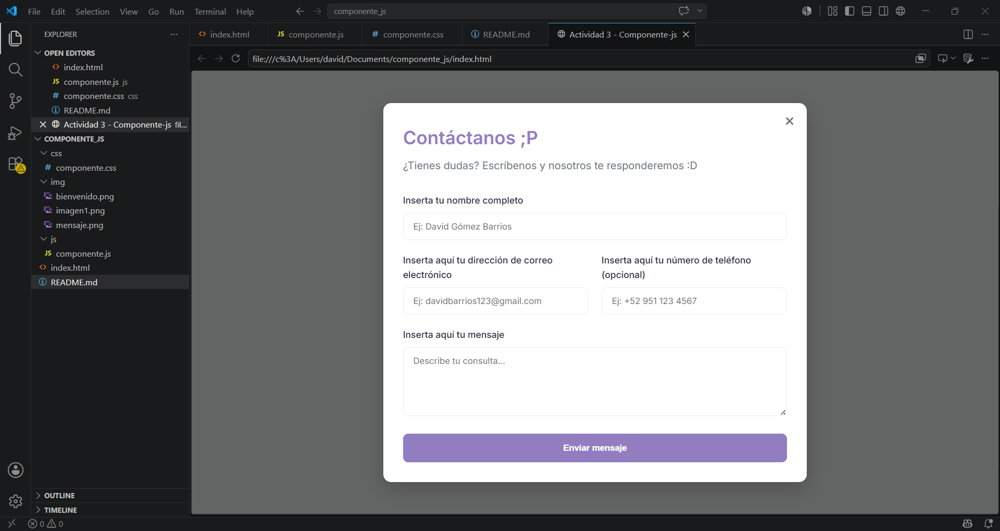
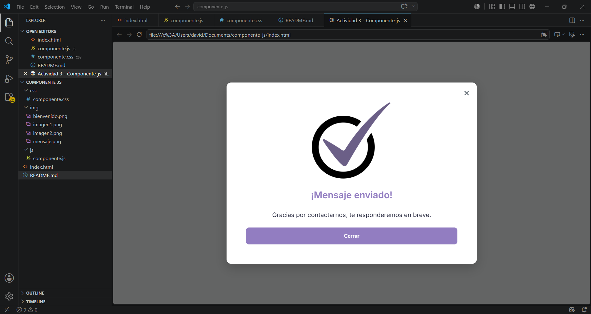

# Autor

**Nombre completo emepzando por apellidos:** José Ramos David Efraín

**Materia:** Programación Web

**Proyecto:** Librería de componente visual con js y css.

**Fecha:** 05/07/2026

---

# Utilería JS - Componente modal reutilizable – Actividad 3

Estamos ante una biblioteca desarrollada con **JavaScript y CSS**, pensada para mostrar notificaciones sobre acciones que el usuario realiza en el sistema al hacer clic. Su propósito fundamental radica en agilizar el proceso de desarrollo web, permitiendo que el código se emplee tantas veces como sea necesario.

En este supuesto concreto, el modal sirve para mostrar un **formulario de contacto** y, al finalizar el proceso de envío, despliega un mensaje de confirmación junto a una imagen adaptada. Este componente es totalmente reutilizable, dado que admite la integración de cualquier contenido HTML al ser invocado mediante `Modal.abrir(html)`.

---

# Estructura del proyecto

   ```
   /
   ├── index.html
   ├── README.md
   ├── css/
   │   └── componente.css
   ├── js/
   │   └── componente.js
   └── img/
       ├── bienvenido.png
       └── mensaje.png
   ```

---

# Instalación

Descarga los archivos **componente.css** y **componente.js** y colócalos en las carpetas correspondientes (`css/` y `js/`). Luego, en el `<head>` de tu HTML incluye la hoja de estilos; el script debe ir antes de terminar la etiqueta `body`.

```html
<link rel="stylesheet" href="css/componente.css">
<script src="js/componente.js"></script>
```

Si los archivos se encuentran en la misma carpeta que tu HTML:

```html
<link rel="stylesheet" href="componente.css">
<script src="componente.js"></script>
```

> **Nota:** El componente requiere la fuente **Inter** de Google Fonts para mantener la consistencia visual. Incluye en el `<head>`:
> ```html
> <link rel="preconnect" href="https://fonts.googleapis.com">
> <link rel="preconnect" href="https://fonts.gstatic.com" crossorigin>
> <link href="https://fonts.googleapis.com/css2?family=Inter:wght@400;500;600&display=swap" rel="stylesheet">
> ```

---

# Descripción del código CSS

## 1. `.modal-overlay`

Abarca toda la pantalla y se establece el color de fondo semitransparente y el posicionamiento fijo. Se inicializa como invisible (`display: none`) y sin interacción. Esta clase se asigna automáticamente desde JavaScript al crear el modal.

### Código

```css
.modal-overlay {
    position: fixed;
    top: 0;
    left: 0;
    width: 100%;
    height: 100%;
    background: rgba(0, 0, 0, 0.6);
    display: none;       
    justify-content: center;
    align-items: center;
    z-index: 1000;
    padding: 20px;
}
```

---

## 2. `.modal-overlay.activo`

Se encarga de hacer visible el modal y permitir la interacción del usuario.

### Código

```css
.modal-overlay.activo {
    display: flex;
}
```

---

## 3. `.modal-ventana`

Es la parte que muestra la información (contenido). Se recomienda que esta clase se asigne a un `div` contenedor.

### Código

```css
.modal-ventana {
    background: white;
    max-width: 650px;
    width: 100%;
    max-height: 90vh;
    overflow-y: auto;
    border-radius: 12px;
    padding: 30px;
    position: relative;
    box-shadow: 0 10px 30px rgba(0, 0, 0, 0.2);
}
```

---

## 4. `.modal-cerrar` y `.modal-cerrar:hover`

Botón para cerrar el modal (la "X" en la esquina superior derecha). La clase con `:hover` permite que el color cambie al pasar el cursor.

### Código

```css
.modal-cerrar {
    position: absolute;
    top: 12px;
    right: 18px;
    font-size: 28px;
    background: none;
    border: none;
    cursor: pointer;
    color: #6C757D;
    transition: color 0.2s;
}
.modal-cerrar:hover {
    color: #2B2D42;
}
```

---

## 5. Estilos del formulario (heredados del Ejercicio #9)

El formulario de contacto utiliza los estilos del Ejercicio #9 del PDF, adaptados para verse correctamente dentro del modal. Los principales son:

- `.contenedor-formulario` – contenedor del formulario.
- `.grupo-formulario` – cada grupo de campo.
- `.grupo-doble` – disposición en dos columnas para email y teléfono.
- `.boton-enviar` – botón de envío con efecto hover.

---

# Capturas de pantalla

## Página de inicio con el botón de apertura

  
*Imagen de bienvenida y botón "¡Haz clic aquí!"*

## Modal abierto mostrando el formulario

  
*Formulario de contacto dentro del modal*

## Mensaje de éxito tras enviar el formulario

  
*Mensaje "¡Mensaje enviado con éxito!" con imagen*

---

# Video demostrativo

[text](https://drive.google.com/file/d/164iHJf1SxN8wfyIeEt6le1Oi1Kv_WxGt/view?usp=sharing)

---

# Tecnologías utilizadas

- HTML5
- CSS3
- JavaScript

--- 
```